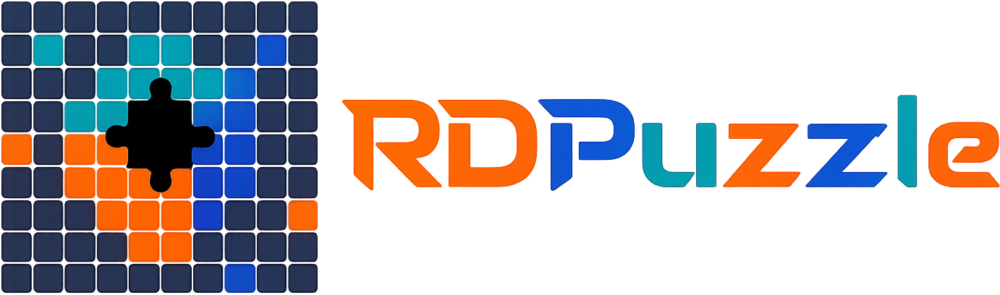

# RDPuzzle

Reconstructs RDP bitmap cache fragments into readable screenshots using neural edge-matching, auto-stitching, and OCR - all locally in the browser.

Loads 64x64 bitmap tiles, scores likely neighbors using HSV, Pearson correlation, and a self-trained neural network (EdgeMatch) that runs in the page, then semi-automatically stitches them into larger images. Has multi-tab workspaces, auto-stitching, low-information tile filtering, OCR, undo/redo, session save/load.

**[Use it directly ](https://bzdaniel.github.io/RDPuzzle/RDPuzzle.html)**

Demo:
<video src="https://github.com/user-attachments/assets/5397af8c-b6c9-430d-9ddc-e5074186f8ac" controls width="800"></video>

---

## Why

The problem is that current tooling for this is very manual and time consuming.

This tool is my attempt to fix that. The goal is to take an artifact that has always been powerful but impractical at scale, and make it actually usable in a real IR workflow, without having to spend half a day on creating a few snippets.

---

## Features

- Neural EdgeMatch scoring (self-trained model, runs in-browser via ONNX)
- Auto-stitching with configurable thresholds
- OCR
- Single HTML file, nothing to install
- Low-information tile filtering (ignores blank/solid tiles)
- Near-duplicate tile skipping on import (99% visual similarity threshold)
- Loads RDP bitmap cache fragments (BMC, BIN)
- Move and swap placed tiles
- Multi-tab workspaces
- Undo / redo
- Save and load sessions
- Export reconstructed grids as images
- All tiles displayed in a grid, drag them onto a reconstruction canvas
- Import image tiles directly

## Matching

The tool combines several signals to decide if two tiles are likely neighbors. When a cell has more than one placed neighbor, each one contributes evidence, so matches get stronger the more neighbors it has.

**Combined score:**
```
HSV score x HSV weight + Pearson score x Pearson weight + EdgeMatch x EdgeMatch weight
```

Weights are configurable. A low-information multiplier penalizes blank or near-solid tiles.

### HSV

Bundled single metric combining two signals:
- **70%** HSV histogram overlap across adjacent tile edges
- **30%** Per-pixel touching-edge color continuity

Good for UI regions, photos, gradients. Weak on flat or repetitive areas.

### Pearson

Compares luminance relationship between two touching edges. Useful when brightness patterns continue across boundaries. Dynamically down-weighted when either tile in a pair is low-detail.

### EdgeMatch (neural)

It's a self trained CNN based on InfoNCE that turns tiles and a direction into a 256-dimensional embedding. Tiles that are likely neighbors end up with similar embeddings. The model was trained on real RDP session data with hard-negative mining.

**Architecture:**

Input is a 64x64 RGB tile plus a direction (left/right/top/bottom). Before the CNN sees it, the tile is rotated or flipped so the edge we care about is always on the right. That way the network only needs to learn right-edge matching, and the direction is handled separately.

The backbone is four ResNet stages with GroupNorm. Channel progression is 3 -> 32 -> 64 -> 128 -> 256. After the backbone, a learned per-direction FiLM modulation scales the features differently for each direction.

There's also a separate small conv net that processes only the right-edge strip of pixels (16px wide by default). This gives the model a dedicated pathway that focuses on the actual tile boundary.

A learned 32-dim embedding for each direction preserves context lost during canonicalization.

Everything gets concatenated (backbone features + edge features + side embedding) and fed through two hidden layers to produce a 256-dim vector, L2 normalized.

**Usage:** Given an anchor tile and a direction, compute its embedding, compute candidate embeddings on the opposing side, compare by cosine similarity. Higher similarity = more likely to be the actual neighbor.

EdgeMatch handles things that simple pixel comparison doesn't: photos, anti-aliased UI, text-heavy tiles, noisy regions, gradients.

---

## Auto-Stitch

Grows reconstructions conservatively:

1. Start from user-placed "seed" tiles if any exist
2. Score all candidates for the frontier (empty cells adjacent to placed tiles)
3. Place the strongest match first (above threshold)
4. Recalculate (because new tiles can create multi-neighbor opportunities)
5. Repeat until no frontier match qualifies
6. Then start a new "island" cell from the unused tile that has the highest "detail" score
7. Continue until no good matches remain or island limit is reached

The island limit controls how many new islands auto-stitch can start. User-placed seeds don't count against it.
For best results, try matching a few cells before auto-stitching.

---

## Low-information tile filtering

Detects blank, solid, or near-empty tiles because solid color background or cmd tiles hold no information and don't help with adjacency.
Calculated based on luminance variance, gradient energy, Sobel edge density, entropy.
Below-threshold tiles are penalized and reduce their neighborship scores.

---

## Cache order

RDP cache order is not a reliable timeline. The cache stores reusable fragments for performance. File order may hint at something but visual matching is the primary signal.

---

## Saving and loading

Sessions save tile metadata, grid placement, tabs, settings, undo history, reconstruction state and embeddings.

---

## OCR

Uses OCR to identify text-heavy tiles. Helpful for browser fragments, terminal windows, document text, dialogs. Assistive signal only.
Two OCR options are available, tesseract running on 4 threads for performance, or paddleOCR running in WebGPU.

---

## Running

Open in a browser. Chrome/Edge/Chromium recommended (ONNX inference, canvas, drag/drop, OCR workers).

---

## Privacy

Runs locally. Parsing, scoring, stitching, export all client-side. Some OCR/model assets may load from external sources depending on configuration.

---

## Limitations

- Cache fragments may be incomplete
- Fragments aren't chronological
- Repeated UI patterns may cause false matches
- Flat backgrounds are hard to stitch but should be penalized by the amount of "data" they hold
- Neural similarity is a ranking signal, not proof
- Auto-stitch still needs manual correction

---

## License

RDPuzzle is available free of charge for personal, educational, academic, and non-commercial research use.

Commercial use, including use by companies, consultancies, MDR/IR providers, internal corporate security teams, or commercial forensic services, requires a separate commercial license.

For commercial licensing, contact: mrdanielbenzano@gmail.com

---

## Author

Daniel Ben Zano

Special thanks to Tal Gaffen
